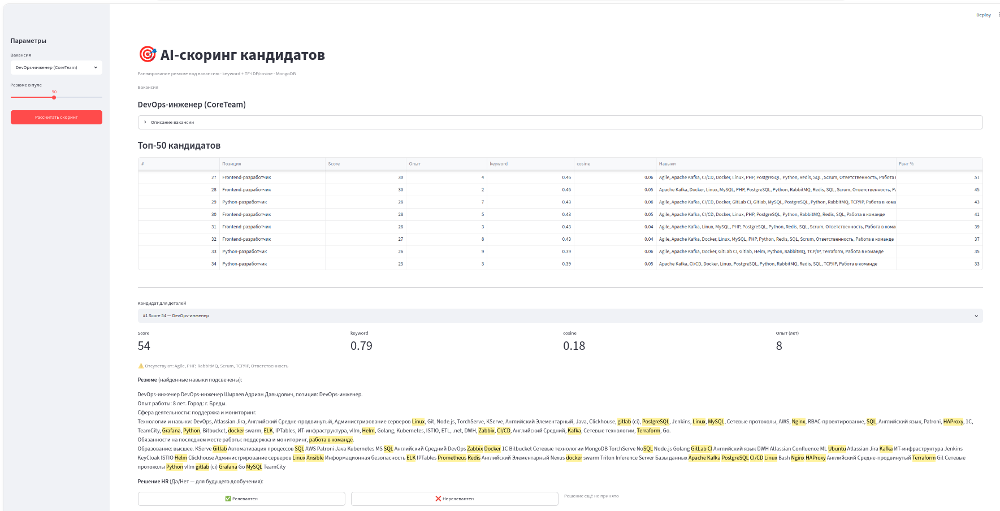

# ui/ — Streamlit-интерфейс (MVP)

Веб-UI без отдельного бэкенда: ходит в MongoDB и дёргает скорер напрямую (`scorer.service.score_vacancy`), поэтому это честный MVP продукт, а не мэйк ап. FastAPI-слой -  отдельно.

## Запуск

```bash
# из корня проекта (нужен запущенный Mongo и данные)
docker start mongo
streamlit run ui/app.py
```

## Файлы

| Файл | Роль |
|---|---|
| [`app.py`](app.py) | Основной поток: выбор вакансии → «Рассчитать» → таблица → детали + фидбек |
| [`highlight.py`](highlight.py) | Безопасная подсветка найденных навыков в тексте резюме (HTML) |

## app.py — поток

1. **Сайдбар:** выбор вакансии + слайдер «Резюме в пуле» (5–100) + кнопка «Рассчитать скоринг».
2. **Таблица** топ-N (`TOP_N = 50`): `Позиция | Score | Опыт | keyword | cosine | Навыки | Ранг %`. При равном Score больше опыта размещается выше — порядок приходит уже отсортированным из `score_vacancy`.
3. **Детали кандидата:** метрики (Score / keyword / cosine / Опыт), отсутствующие навыки, текст резюме с подсветкой, кнопки фидбека **✅ Релевантен / ❌ Нерелевантен** (сохраняются в `hh_feedback` через `mongo.save_feedback`).

Результаты скоринга кешируются в `st.session_state`, так что таблица не пересчитывается на каждом действии.

## highlight.py

`highlight_skills(text, skills)` — оборачивает каждое упоминание любого сурфейс-алиаса переданных *канонических* навыков в `<mark>` (алиасы берутся из онтологии `scorer.skills_dict`). **Безопасность:** текст сначала HTML-эскейпится, `<mark>` добавляется только к сматченным спанам, `\n` → `<br>`. XSS через резюме невозможен.

## Зависимости

`streamlit` и остальные — пакеты проекта (`scorer`, `db`) ставятся на уровне проекта.

## Внешний вид приложения


